# Testing

## Table of contents: 

* [Bugs, Problems and Fixes](#bugs-problems-and-fixes-encountered-during-the-building-process)
    * [Getting the title image to overlap hero](#getting-the-title-image-to-overlap-the-hero-image)
    * [Ellipse corners on boxes](#corners-on-boxes-were-appearing-as-an-ellipse-shape-rather-than-quarter-circles)
    * [Navbar toggler not closing](#bootstrap-navbar-toggler-wasnt-closing-when-the-burger-icon-was-pushed)
    * [Changing the bootstrap version](#changing-the-bootstrap-version-to-ensure-css-validation)
    * [Git commit messages](#git-commit-messages)
    * [Other](#other-small-issues-as-mentioned-in-credits)

* [Accessibility Testing](#testing-for-accessibility)
    * [Tests](#tests)
    * [Failed Tests and Fixes](#failed-tests-and-fixes)
    * [Repeated Failed Tests](#repeated-tests)

* [Functionality Testing](#functionality-testing)
    * [Tests](#tests-1)
    * [Failed Tests and Fixes](#failed-tests-and-fixes-1)
    * [Repeated Failed Tests](#repeated-tests-1)

* [Responsiveness Testing](#responsiveness-testing)

* [Browser Testing](#browser-and-device-testing)

* [User Story Testing](#testing-user-stories)

* [Validation](#validation) 

* [Lighthouse Testing](#lighthouse-testing)
    * [Desktop](#desktop)
    * [Mobile](#mobile)

## Bugs, Problems and Fixes encountered during the building process

### Getting the title image to overlap the hero image 

Initially, I made the container position relative and the hero image and the title image position absolute. This worked to create the overlapping effect but then caused an issue with the rest of the content. The remainder of the content was then being push up behind the hero image.

First, I tried to put position: absolute; only on the title to leave the hero image a the default position: static;. This fixed the issue of other content being pushed under the hero image, and the title was in the correct place but was sitting behind the hero image. Changing the z-index didn't help. 

After much trial and error, I realised that change the order of the html meant the if I put the title image first, it would appear on top of the hero. See code: 

HTML: 
```
<div class="hero-container">
   
   
   <!-- Full size image for smaller screens -->
   
   <!-- Cropped image for larger screens -->
   
</div>
```
CSS: 
```
.hero-container {
    position: relative;
    display: flex;
    justify-content: center;
    max-height: 80vh;
}
.hero-title-horizontal {
    position:absolute;
    width: 90%;
    margin-top: 10px;
}
.hero-title-vertical {
    position: absolute;
    margin-top: 20px;
    max-height: 85%;
}
```

### Corners on boxes were appearing as an ellipse shape rather than quarter circles: 

Used [this](https://stackoverflow.com/questions/31617136/avoid-elliptical-shape-in-css-border-radius#:~:text=If%20the%20value%20exceeds%20half,pill%20shape%20on%20rectangular%20elements.&text=border%2Dradius%3A%2050%25%20will,your%20div%20is%20not%20square.) forum to gain better insight into border radius and changed my measures from relative (%) to absolute (px) and this resolved the issue.

### Bootstrap Navbar toggler wasn't closing when the burger icon was pushed

After a lot of very close checking of my code, I found [this](https://www.youtube.com/watch?v=ulM3-nRABgk&ab_channel=ByteGrad) video which pointed me to look at the JS popper that I had put in separately to the other bootstrap links. This extra popper was not needed and was causing this issue. Removing it solved the problem. 

### Changing the bootstrap version to ensure CSS validation 

I left my CSS validation right until the end and then realised the latest version of bootstrap was not validating. I changed it to the newest version that would validate. This caused my "hamburger" dropdown icon to disappear. I fixed this by using a font awesome icon instead and styling it to look visually pleasing. Another issue that arose was that clicked links or ones that were hovered over were not appearing blue so I had to target the links correctly with the colour I wanted in my stylesheet.

### Git commit messages

I wanted to use simple and consistent wording for my commit messages but initially used "build" for all the initial code that was "first time" code, however I realised this wasn't common usage. After doing some reading I decided on the following for all remaining commit messages.

| Commit message | Meaning 
| --- |--- |
|**feat** | adding or removing of features | 
|**fix** | fixing any problems, whether that was during the development process or during the testing phase.  |
| **refactor** | any code changes that didn't affect the output or structure of the code significantly such as renaming classes, removing commented out code, fixing spelling errors, changing images that were converted to a different type etc.  |
|**docs** | anything related to the readme or testing files|

In future I would look to implement something like the following to make them more descriptive:


### Other small issues as mentioned in credits

## Testing for accessibility 

### Tests

| Expected Outcome                                                                                               | Process to test                                                                      | Outcome |
| -------------------------------------------------------------------------------------------------------------- | ------------------------------------------------------------------------------------ | ------- |
| All images on home page (large screen) have alt texts -  3 images (hero, horizontal title text and logo image) | Use WAVE chrome extension to check presence of alt text and check code for alt texts |  Pass   |
| All images on home page (small screen) have alt texts -  3 images (hero, vertical title text and logo image)   | Use WAVE chrome extension to check presence of alt text and check code for alt texts |  Pass   |
| All images on services page have alt texts -  7 images (hero decoration only so not alt text, logo image and 6 gallery images)                 | Use WAVE chrome extension to check presence of alt text and check code for alt texts | Pass    |
| All images on contact page have alt texts -  1 images (logo image)                                             | Use WAVE chrome extension to check presence of alt text and check code for alt texts |  Pass       |
| All images on 404 page have alt text - 1 images (logo image,background image for decoration only)                              | Use WAVE chrome extension to check presence of alt text and check code for alt texts |  Pass   |
| Semantic HTML has been used and role and purpose of features is clear (home page)                              | Use WAVE chrome extension to identify any unclear elements or tags                   |   FAIL  |
| Semantic HTML has been used and role and purpose of features is clear (services page)                          | Use WAVE chrome extension to identify any unclear elements or tags                   |   FAIL  |
| Semantic HTML has been used and role and purpose of features is clear (contact page)                           | Use WAVE chrome extension to identify any unclear elements or tags                   |    Pass |
| Semantic HTML has been used and role and purpose of features is clear (404 page)                               | Use WAVE chrome extension to identify any unclear elements or tags                   |    Pass  |
| Check colour contrast using WCAG Color contract checker chrome extension                                       | Ensure that all colours pass | FAIL |

### Failed Tests and Fixes: 

1. Semantic HTML has been used and role and purpose of features is clear (home page): 

WAVE IDENTIFIED (fixes completed on all pages before running remaining tests): 
- no h1 on the page   
This was corrected by adding a h1 to the hero image section but applying to the [bootstrap "visually-hidden" class](https://getbootstrap.com/docs/5.0/helpers/visually-hidden/)
- empty link (facebook icon)   
This has been corrected by adding a span with "visually-hidden" class that says "Navigate to Facebook". Advice taken from [here](https://kittygiraudel.com/2020/12/10/accessible-icon-links/) and [here](https://a11y-101.com/development/icons-and-links#:~:text=Enhance%20icon%20with%20text,the%20icon%20within%20the%20link.&text=VoiceOver%20will%20read%20link%2C%20home,%3A%20URL%20comma%20read%2Donly%20.). 
- links containing "click here" or just "here" should be reworded   
Removed "click here" from first button and add visually hidden span to describe the "here" link that may be read out of context on a screen reader.

2. Semantic HTML has been used and role and purpose of features is clear (services page):

WAVE IDENTIFIED (fixes completed on all pages before running remaining tests):

- heading level 5 on images was inappropriate use of heading and skipped other heading levels. Rectified by changing to p tag. 

3. Check colour contrast using WCAG Color contract checker chrome extension

Chrome extension identified that the starred writing at the bottom of the service list did not have enough contrast so colour changed.

### Repeated Tests:

| Expected Outcome                                                                                               | Process to test                                                                      | Outcome |
| -------------------------------------------------------------------------------------------------------------- | ------------------------------------------------------------------------------------ | ------- |
| Semantic HTML has been used and role and purpose of features is clear (home page)                              | Use WAVE chrome extension to identify any unclear elements or tags                   |   Pass  |
| Semantic HTML has been used and role and purpose of features is clear (services page)                          | Use WAVE chrome extension to identify any unclear elements or tags                   |   Pass  |
| Check colour contrast using WCAG Color contract checker chrome extension                                       | Ensure that all colours pass | Pass |

## Functionality Testing 

The following tests were completed on both a windows laptop and an android phone, primary tests on chrome and then firefox and edge were also tested. 

### Tests

| TEST                                                                                        | Expected Outcome                                                                            | Pass/Fail |
| ------------------------------------------------------------------------------------------- | ------------------------------------------------------------------------------------------- | --------- |
| Click on the link in all pages to ensure it returns to home page | 77 Logo in top right takes you back to the home page from all 4 pages |   Pass    |
| Click on the navigation links in all pages to ensure it returns to the correct page | All navigation links take you to the correct place from all 4  |   Pass     |
| Click on icon in all pages to ensure it takes you to business Facebook page | Footer Facebook icon takes you to Facebook from all | Pass |
| Navigate to each page and make sure the correct page is highlighted in the nav bar | Current page is highlighted in nav bar | FAIL |
| Type an incorrect address to check 404 page appears| 404 error page gets invoked when incorrect address is typed |    Pass   |
| Click on "take me back to safety" button | Return to homepage when button is clicked |    Pass   |
| Click on Get in touch now! button to check it takes you to contact page | Get in touch now! button takes you to contact page |  Pass |
| Click on the "here" button and check it takes you to services table| Click here for a full list of services button takes you to services table | Pass  |
| Click on the "here" button and check it takes you to contact page  | Services page "here" button takes you to contact page|  FAIL  |
| Press play button and ensure video plays | Video on services page plays when play button is pressed | Pass |
| Hover (click on phone) over each image (and then remove hover) and check for expected outcome | Gallery images increase in size, have an overlay and slowly decrease in size when you hover (or click on phone) | Pass |
| Click on icon on contact page to ensure it takes you to business Facebook page| Facebook icon on contact page takes you to business Facebook page|   Pass  |
| Click on the button to ensure it takes you to business Facebook page | "Message me on Facebook button" takes you to business Facebook page | Pass |
| FORM: Enter all correct information with all checkboxes ticked and written text in textarea | CI form dump returns the correct inputted information|  Pass  |
| FORM: Same as above but enter invalid email| Not allowed to submit | Pass |
| FORM: Same as first form test but do not enter email  | Not allowed to submit | Pass |
| FORM: Same as first form test but do not enter name | Not allowed to submit | Pass |
| FORM: Same as first form test but do not enter phone number | Not allowed to submit |  Pass |
| FORM: Same as first form test but no boxes checked | Allowed to submit, no service information in CI form dump | Pass |
| FORM: Same as first form test but only 1 box checked (check each one individually)| Allowed to submit, only one (correct) service information in CI form dump | FAIL (other fretwork) |
| FORM: Same as first form but no text in textarea | Not allowed to submit | Pass |
| MAP: move map around by holding click, zoom in and out with cursor| Correct address appearing, able to move map with cursor, able to zoom in and out |  Pass  |


### Failed tests and fixes:

1. Current page is highlighted in nav bar

The services nav link is highlight on the error page. Remove any active classes from error page.

2. Services page "here" button takes you to contact page

Update the wrong link.

3. Allowed to submit, only one (correct) service information in CI form dump 

Change incorrect value

### Repeated tests:

| TEST | Expected Outcome  | Pass/Fail |
| ------ | ------------- | --------- |
| Navigate to each page and make sure the correct page is highlighted in the nav bar | Current page is highlighted in nav bar | Pass |
| Click on the "here" button and check it takes you to contact page  | Services page "here" button takes you to contact page|  Pass  |
| FORM: Same as first form test but only 1 box checked (check each one individually)| Allowed to submit, only one (correct) service information in CI form dump | Pass |

## Responsiveness testing

### Method for testing and breakpoints used

I will use google chrome and firefox developer tools "responsive" mode to slowly move the screen to make it continuously larger within certain breakpoints.

I have used the bootstrap breakpoints for this testing. 

I will also test the exact resolutions of a common mobile, tablet and monitor. I used 360x800, 768x1024 and 1920x1080. I decided these based on popularity of use using [this](https://www.linkedin.com/pulse/most-popular-screen-resolutions-mobile-tablet-desktop-elziady/) article. 

### Testing 

All pages were tested, and developer tools were used on both chrome and firefox. 

|   Screen width | Expected Outcome  | Pass/Fail |
| ---------------------------- | ------------- | --------- |
| 320px - 575px  | No errors where items are overlapping, touching the edge of the screen when they shouldn't, or text being pushed under or out of the container. All sizes seem proportionate to screen size | Pass |
| 576px - 767px  | Same as first row |  Pass  |
| 768px - 991px | Same as first row   | Pass |
| 992px - 1199px | Same as first row   | Pass |
| 1200px - 1400px | Same as first row   | Pass |


|  Device          | Expected Outcome  | Pass/Fail |
| ---------------------------- | ------------- | --------- |
|Mobile | No errors where items are overlapping, touching the edge of the screen when they shouldn't, or text being pushed under or out of the container. All sizes seem proportionate to screen size | Pass |
| Tablet  | Same as first row |  Pass  |
| Desktop | Same as first row   | Pass |

## Browser and device testing 

- During the functionality testing, all checks were made on Chrome, Firefox and Edge. 

- During the responsiveness testing all of the testing was done on Chrome and  Firefox. 

- I also used this website on a variety of android phones and one iphone, and checked it was working as expected. 

- I did not have access to any apple products so I couldn't do any full testing with safari without spending money for simulators. 

## Testing User Stories

- **A: As a first time visitor, I want to see the prices clearly, so that I can decide if the repair is in my price range.** 

A price list can be accessed from the services page clearly labelled in the nav bar:

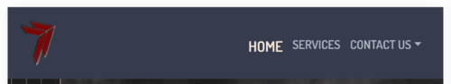

Services linked in primary info on home page:

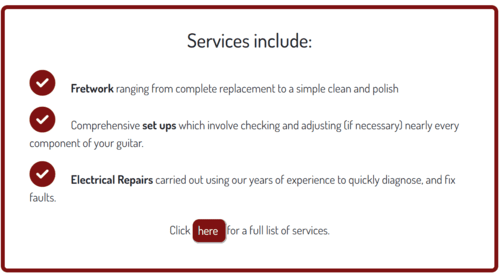

- **B: As a first time visitor, I want to understand how to get in contact, so that I can request a repair on my guitar.**

Contact details can be accessed multiple times throughout the page.

In the navigation bar - link to all forms of contact:


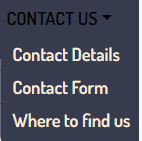

In the footer: 


In the contact page, multiple ways to contact so client can pick the one easiest to them (least resistance to purchase): 

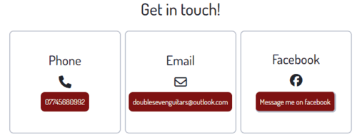

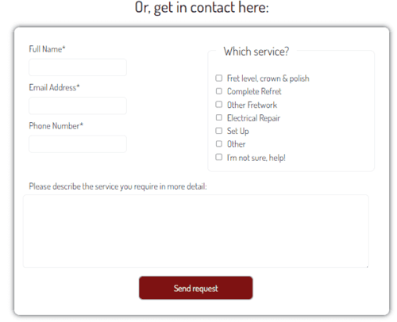

Button that links to contact page on home page: 

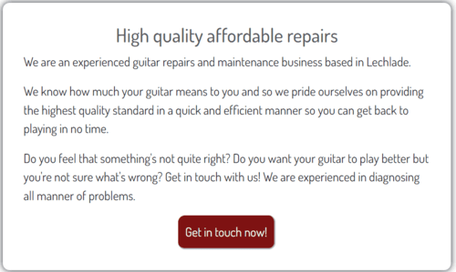

Link to contact page on services page: 


- **C: As a first time visitor, I want to see the reviews of the business, so that I can see how well-known and liked they are and thus have confidence in the guitar repair (particularly important for experienced guitar owner).**

Reviews are at the bottom of the home page:

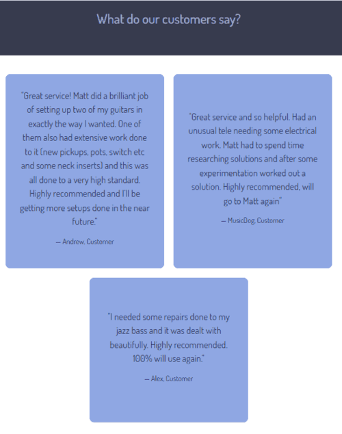

•	**D: As a first time visitor, I want to check the location of the business, so that I can see if it is feasable to drop off/pick up my guitar.**

Link to location in contact drop down in nav bar: 


Address and map on contact page:

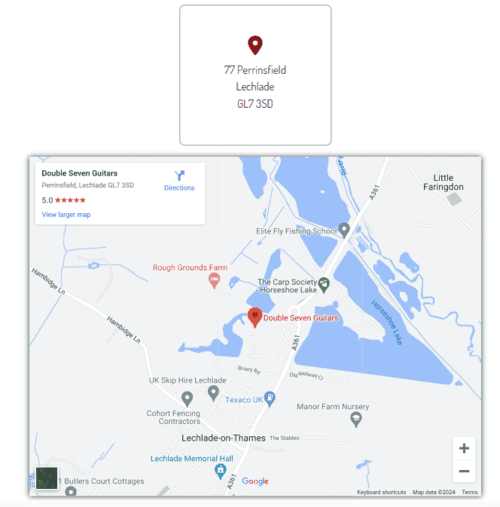

- **E: As a novice guitar owner (first time visit), I want to see a clear and easy-to-understand list of services, so that I can choose the appropriate service.** AND  **E: As a novice guitar owner (first time visit), I want to be given information of about types of repairs and maintenance so that I can understand what services I might need. (F)**

Service information give on home page: 


Service list on services page: 

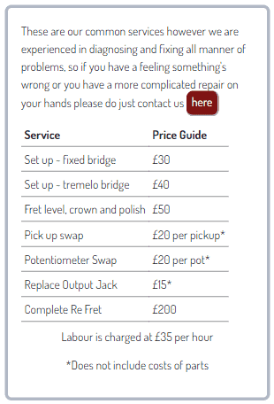

If the novice guitar owner is not sure which service to pick, it is referenced that the business can diagnose the problem easily and there is also a form box that says "I'm not sure, help!

- **G: As an experienced guitar owner (first time visit), I want to see whether more complicated repairs are available, so that I can decide if my problem can be resolved by the business** AND
**H: As an experienced guitar owner (first time visit), I want to see what types of repairs the business has experience in, so that I can trust my more complicated guitar repair with the business**

On the services page there is a gallery that includes more complicated/niche repairs to give confidence of business skill: 

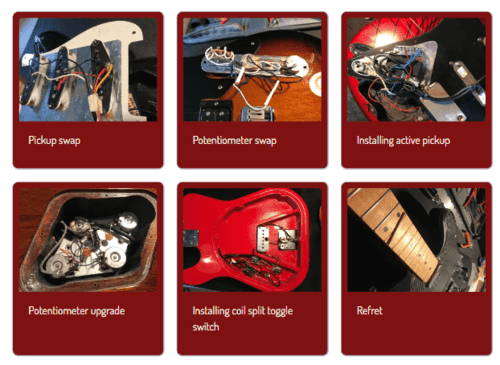

On the services page there is a video of a repair being conducted to give confidence of business skill:

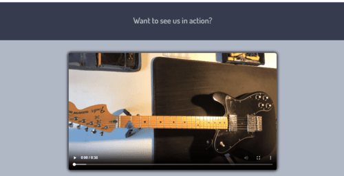

FUTURE IMPLEMENTATION: This user story is somewhat satisfied but there could more detailed images and videos of repairs as well as detailed explanation of types of fixes. This was unavailable at this time due to the limited nature of images provided by the business but could be in a future implementation. 

- **I: As a returning visitor, I want to check the contact details again to ensure I have them correct for a request of another repair**

Same as User Story B above. 


## Validation 

A note on html and css validation: all pages initially had some failures which were educational. A lot were concerned with wrapping a button in an a tag, or vice versa. Others were minor issues that could be resolved easily. The major issues was the version of bootstrap I was using not validating. In hindsight, I should have been using the validator as I went along to avoid having to bulk changes near the end of the project.

### index.html html validation

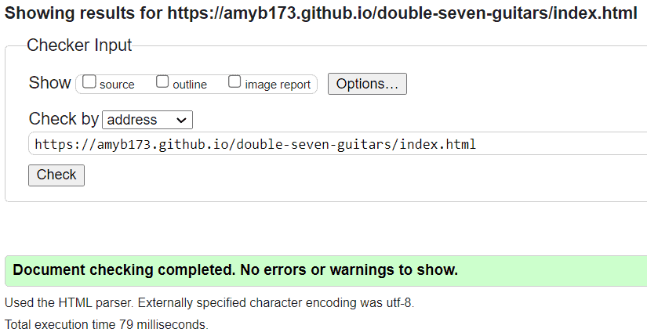

### contact.html html validation

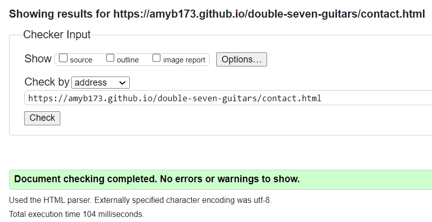

### services.html html validation

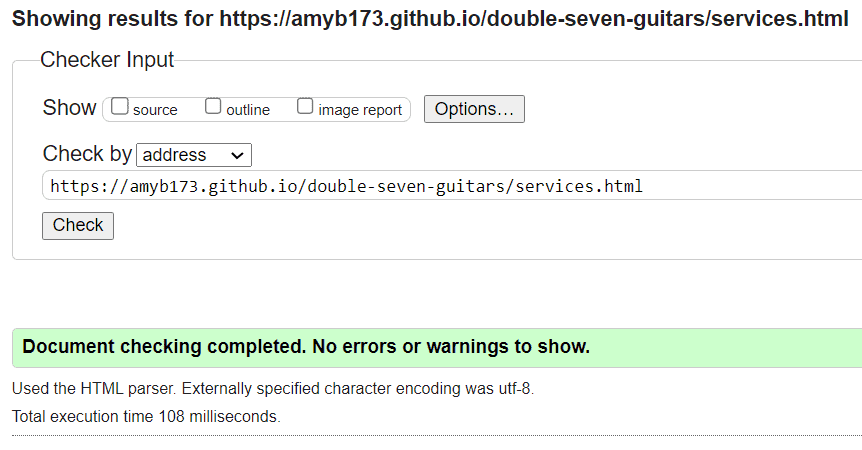

### 404.html html validation

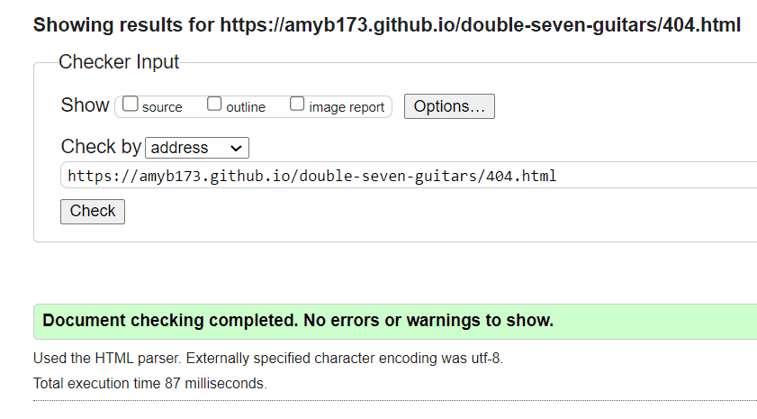

### CSS validation 

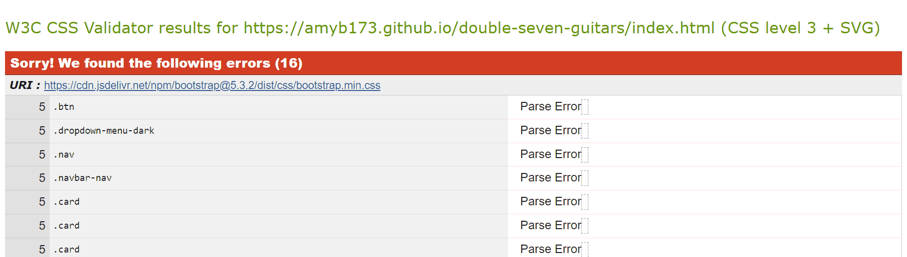

This failed because of the bootstrap version I was using. I made some updates which are detailed in the [bugs section](#bugs-problems-and-fixes-encountered-during-the-building-process) of this page. I repeated all tests with this new version to ensure no expected issues arose from changing the bootstrap version. 

All tests passed and it now passed the css validation: 

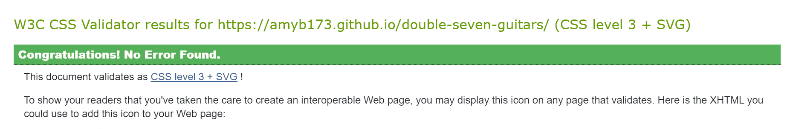


## Lighthouse Testing

I initially ran some lighthouse testing before finishing my project and decided to compress all images and then convert them to webp format to improve the performance. This made a big difference and was a good learning opportunity for me.

### Desktop 

#### Home Page


#### Services Page


#### Contact Page 

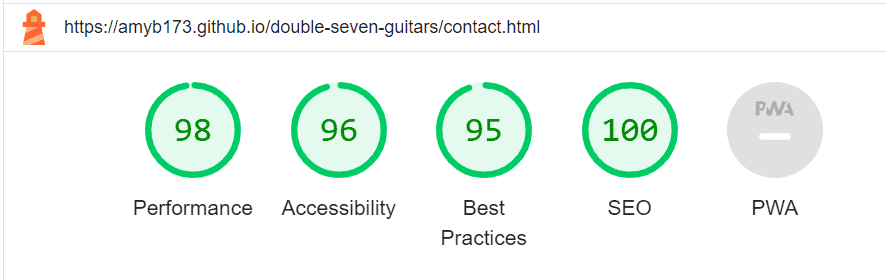

I improved the accessibility and best practices by adding a title to my iframe and by adding autocomplete to two form inputs (although this didn't end improving the best practices result):

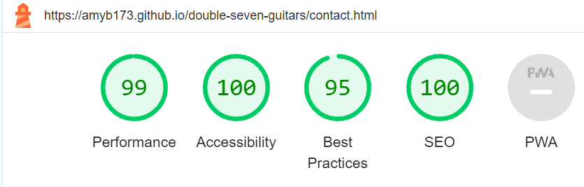

The best practice was not 100% because of an issue with third party cookies from the maps. I tried to see if there was sometimes I could do to rectify this but felt it was not within the scope of this course.

### Mobile 

#### Home Page

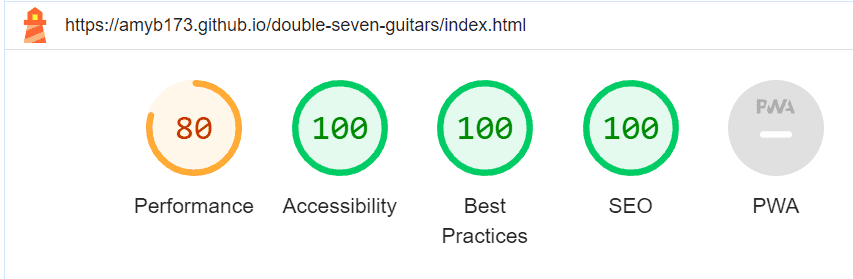

#### Services Page


#### Contact Page


[def]: #tests